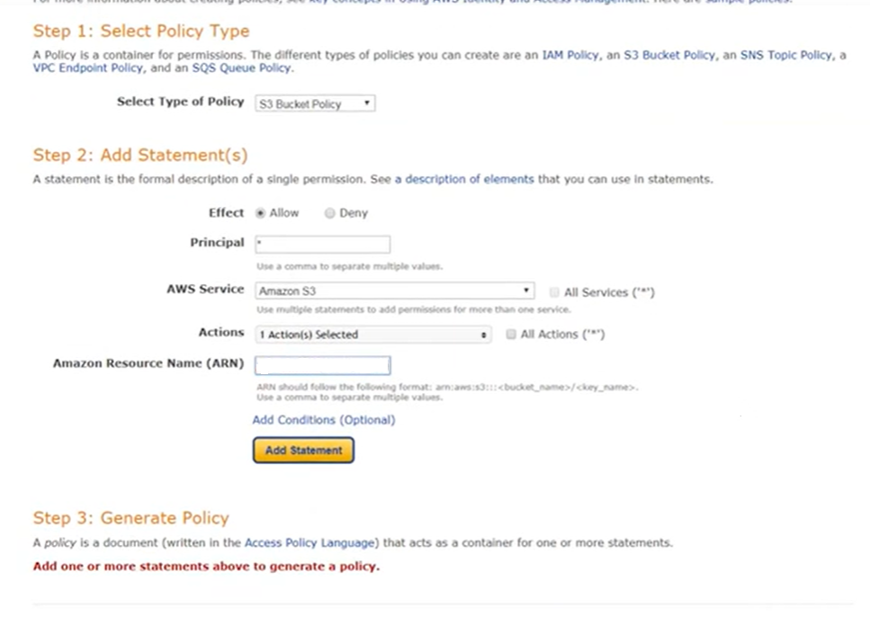

# E-commerce Site of Hardware and Landscaping Supplies Business

​
<p align="center" width="100%"> 

</p>

<span style="font-weight:bold; font-size:16px">Project Brief</span>
<p> This project is for the design and deployment of a functional E-commerce website for a business which supplies materials, hardware and tools primarily in the areas of Agriculture, Landscaping and construction.</p>


[This is an external link to the site](https://tw-shop.herokuapp.com/)

For this purposes I have listed login at this link : [User Test Information](#user-test-information)

<br>

<span style="color:#56a832; font-weight:bold; font-size:16px">Origins of the project</span>
<p> Text </p>

<span style="color:#ebd80c; font-weight:bold; font-size:16px">A proposed solution.</span>
<p> Text </p>

<br>

<p align="center" width="100%"> 

</p>


​

## Contents
​
- [Tommy Williamson Landscape & Agri Supplies](#contents)
  - [Contents](#contents)
  - [UX](#ux)
    - [Project Goals](#project-goals)
    - [User Stories](#user-stories)
    - [User Requirements and Expectations](#user-requirements-and-expectations)
      - [Requirements](#requirements)
      - [Expectations](#expectations)
    - [Design Choices](#design-choices)
      - [Fonts](#fonts)
      - [Colours](#colours)
      - [Images](#images)
      - [Agile Methodology](#agile-methodology)
  - [Wireframes](#wireframes)
    - [Site Layout](#site-layout)
  - [Information Architecture](#information-architecture)
  - [Technologies](#technologies)
    - [Languages](#languages)
    - [Libraries & Frameworks](#libraries--frameworks)
    - [Tools](#tools)
  - [Features](#features)
    - [Implemented Features](#implemented-features)
    - [Future Features](#future-features)
  - [Development](#development)
    - [bUg5 & (F)ixes](#bugs--fixes)
  - [Testing](#testing)
    - [User Test Information](#user-test-information)
  - [Deployment](#deployment)
    - [Final Deployment](#final-deployment)
    - [Cloning](#cloning)
  - [Credits](#credits)
    - [Image editing](#image-editing)
    - [Code ideas](#code-ideas)
  

​
---
​

## UX
​
### **Project Goals**
​
Text
​
### **User Stories**
<p>The project was designed using the concepts of the Agile approach. A project was opened on Github and linked to the repository.</p>

USER STORIES:​
<p>I have attached a link to the User Stories and their status.</p>

[Link to User Stories](readme_docs/user_stories/User%20Stories.pdf)

|GitHub Link |	Issue Type |	Description |	Tested |	Completed |
|------------|-------------|--------------|--------|------------|    
|https://github.com/TNolan01/tommy1/issues/1| 	USER STORY |	As a shopper I can register and new account with login features.|		
|https://github.com/TNolan01/tommy1/issues/2| USER STORY	| As a shopper I can view a list of products for sale.	|	
|https://github.com/TNolan01/tommy1/issues/3|	USER STORY |	As a shopper I can sort and view products via categories to easily find what I am looking for.|		
|https://github.com/TNolan01/tommy1/issues/4|	USER STORY	| As a shopper I can register and new account with login features. |		
|https://github.com/TNolan01/tommy1/issues/5|	USER STORY	| As a shopper I can purchase items I have put in my basket.|		
|https://github.com/TNolan01/tommy1/issues/6|	USER STORY	 | As a shopper I can review my order before completing my purchase. |		
|https://github.com/TNolan01/tommy1/issues/7|	USER STORY	| As a shopper I will receive an email to confirm my purchase. |		
|https://github.com/TNolan01/tommy1/issues/8|	USER STORY | As a shopper I can sign up to receive details of special offers.|		
|https://github.com/TNolan01/tommy1/issues/9|	USER STORY |As a shopper I can browse the site of phone, tablet, and desktop screens.|		
|https://github.com/TNolan01/tommy1/issues/10| USER STORY |	As a visitor I can view and navigate the site with ease.|		
|https://github.com/TNolan01/tommy1/issues/11|	USER STORY |	As a site user I can see notification messages so I know the site is aware of the actions I have taken and these actions are confirmed.|		
|https://github.com/TNolan01/tommy1/issues/12|	USER STORY |	As a returning user the site will remember my address for fast checkout.		
|https://github.com/TNolan01/tommy1/issues/13|	USER STORY |As the site owner I can edit and update the details of products and prices.		
|https://github.com/TNolan01/tommy1/issues/14|	USER STORY	|As the site owner I can remove a product or products which are no longer available.		
|https://github.com/TNolan01/tommy1/issues/15|	USER STORY	|As the site owner I can add new product(s) to the site.		


​<br>

[Back to content](#contents)

---
​
### User Requirements and Expectations
​
#### **Requirements**
​
- Visually pleasant site design and layout.
- Easy site navigation
- Content laid out in a simple and clear way on both mobile and larger screens
- Self-explanatory icons where text is absent
​
#### **Expectations**
​
- Easy to use interface.
- Clear and easy to read data.

​<br>
[Back to content](#contents)

---
​
### **Design Choices**

Text 
​
#### **Fonts**
The main font I have chosen is the Lato font from Google Fonts.

- *Main Font* 

​  ```font-family: Lato font - from Google Fonts```
<br>

#### **Images**
There is logo image

<p align="center" width="100%"> 

</p>

<br>
A Favicon icon pack was created using my drawing of the one of the companies delivery trucks as inspiration.

<br>

<p align="center" width="100%"> 

</p>

<br>

<p>The logos on the Home page were created by me using free clipart images frame with a black border and all sized 280 x 200 pixels ( W x H ).</p>


#### **Colors**
The business uses these red trucks for deliveries. This is a conscious branding exercise on their part. With all previous and current vechicles using the same red and black color scheme.

I am looking at a principal color scheme for the site of red, black and white.

White as the primary background color.
<ol>
<li>This will help keep the screen bright and 'clean'</li>
<li>White offers a better contrast with the displayed information</li>
</ol>

To break this white colour I have added two colors, a green and a yellow, to style some container and card items and create some divisions on the screen. 

<p align="center" width="100%"> 

</p>
​
Text

<br>
<br>

#### **Agile Methodology**


The design, development and testing of this application were tracked through a Kanban board in a created GitHub project.

[Link to Kanban Board](https://github.com/users/TNolan01/projects/5)
<br>

<p align="center" width="100%"> 

</p>

<br>


[Back to content](#contents)
​

---
## Wireframes
​
### **Site Layout**

<p>The initial layout for the site was layout with wireframes created in Balsamiq. These images can be viewed via the link below.</p>

<br>

<p> When the wireframes were rendered on screen with Bootstrap, HTML and CSS there were slight changes to the UX design and layout. As the development process continued further style changes were made in the screen layout. The layout was altered in line with some live testing.

​[Link to Wire Frames](readme_docs/wireframes/Wire_Frames.pdf

[Back to content](#contents)
​

---
​
## Information Architecture
​
### **PostgreSQL Database**
The backend database is a PostgreSQL Database hosted via Heroku. The database is built around .....
#### **Models:**
<ul>
<li> </li>

</ul>
<br>


<br>


**Model 1**

Text 

**Model 2**

Text

[Future Features](#future-features).

**Model 3**

Text

**Model 4**

Text


​
[Back to content](#contents)
​

---
​
## Technologies
​
### Languages
​
- [HTML](https://developer.mozilla.org/en-US/docs/Web/HTML)
- [CSS](https://developer.mozilla.org/en-US/docs/Web/CSS)
- [JavaScript](https://developer.mozilla.org/en-US/docs/Web/JavaScript)
- [Python](https://www.python.org/)
​
### Libraries & Frameworks
​
- [Django](https://www.djangoproject.com/)
- [Google Fonts](https://fonts.google.com/)
- [Font Awesome](https://fontawesome.com/)
- [Favicon](https://favicon.io/)
- [jQuery](https://jquery.com/)
- [Bootstrap](https://getbootstrap.com/)
- [Crispy Forms](https://django-crispy-forms.readthedocs.io/en/latest/)
- [Pillow](https://pypi.org/project/Pillow/)
- [Stripe](https://stripe.com/ie)
​
### Tools
​
- [Git](https://git-scm.com/)
- [GitHub](https://github.com/)
- [Balsamiq](https://balsamiq.com/) - Wireframe tool

### Deployment

- [Heroku](https://www.heroku.com/)
- [AWS, Amazon Web Services](https://aws.amazon.com)

[Back to content](#contents)

---
​
## Features
​
The application uses a PostgreSQL database which contains the purpose designed models.
​
The site uses the Django and Bootstrap 

### Implemented Features
​
- The site has **responsive design** when viewed on a mobile, tablet, and desktop.

- **Easy navigation** to external sites, such as social media accounts.

- T

## Future Features


[Back to content](#contents)
​

---
​
## Development

<p>In this section I deal with some of the bugs and errors encountered during the development process. If the issue was sucessfully fixed I have included details of that fix.</p>

## Bugs & Fixes

### Issue No.1


---

## Testing
​
## Functional Testing
The testing and result of same are located in a separate file​.

Testing results [here](TESTING.md)
<br>​
​

## Validator Testing

​
### <span style="color:#56a832; font-weight:bold; font-size:20px">CSS</span>
​
CSS was tested using [W3C CSS Validation Tool](https://jigsaw.w3.org/css-validator/)
​​<br>


​
### <span style="color:#ebd80c; font-weight:bold; font-size:16px">JavaScript</span>

The script.js file was tested with [JSHint](https://jshint.com/) and showed no errors or warnings. 
​<br>


### <span style="color:#56a832; font-weight:bold; font-size:20px">HTML</span>
​
HTML files associated with this project were tested individually with [W3C Validator](https://validator.w3.org/) and showed no errors or warnings. 
<br>


### <span style="color:#edb80c; font-weight:bold; font-size:20px">Python</span>
​
I have tested Python code in this project with [PEP8](http://pep8online.com/). The only error located in some of the Python files are a number of <span style="color:#FF0000; font-weight:bold">E501</span> errors which are <span style="color:#FF0000; font-weight:bold">line too long (a line greater than 79 characters)</span>.

I have decided not to alter the relevant lines to fit into 79-character restriction. 
- Having researched the options there is some mention of the effects on Django.
- I believe it would reduce of the readability of the code to chop lines.

​<br>
<p align="center" width="100%"> 

</p>
<br>


---

### <span style="color:#ebd80c; font-weight:bold; font-size:16px">Light House Performance Testing</span>

### Desktop Performance :
<br>
<p align="center" width="100%"> 

</p>
<br>


### Mobile Performance :
<br>
<p align="center" width="100%"> 

</p>
<br>

<br>
<p align="center" width="100%"> 

</p>
<br>

<br>
<p align="center" width="100%"> 

</p>
<br>

[Back to content](#contents)
​

## User Test Information 

In conjuction with creating a new 'visitor' login the following login information can be used to test the site.

[Link to User Stories](readme_docs/user_stories/User%20Stories.pdf)

<br>


<br>

---
​
## Deployments
​
### Deployment:

<br>

Deployment of this project is carried out with Heroku, https://www.heroku.com. The deployment procedure is a follows.  
<ol>
<li>Log in to Heroku, creating a new account if you are not a current user.</li>
<li>Click on the 'New' button in the top right corner and from the drop-down menu select 'Create new app'.</li>
<li>Create an App name and select your Region from menu.</li>
<li>Click the 'Create App' button.</li>
<li>Click in resources and select Heroku Postgres as the project database.
<li>You will now have a menu for your new app. From here click on the Settings Tab and in the Config Vars. Click Reveal Config Vars. <br>
<ul>
<li>add your Secret Key</li>
<li>add PostgreSQL URL</li>
<li>add PORT with value '8000'</li>
<li>add a record - 'DISABLE_COLLECTSTATIC = 1'</li> 
</ul>
</li>

<br>
<p align ="center">
</p>
<br>

<li>Scroll down to the Buildpacks section. Click Add buildpack. From the menu select heroku/python and click Save Changes. </li>

<br>
<p align ="center">
</p>
<br>

<li>Return to menu at the top of the page and click on Deploy. Select Github as the deployment method.</li>
<li>Confirm you want to connect to GitHub using your account credentials for Git. Once Heroku has access search for the relevant repository name and click the connect button.</li>
<li>At the bottom of the deploy page select the preferred deployment type. You can use Manual Deploy which will deploy based on the current state of the selected Git branch. You can also Enable Automatic Deploys for automatic deployment when you push updates to Github selected branch.</li>
</ol>
<br>

## Amazon AWS 
### Setting AWS bucket


1. Create an account AWS [Amazon Web Services](https://aws.amazon.com/) or login to an existing account (Credit Card required to register an account.)

2. Navigate to the AWS Managment Console and search for S3 Service.

3. Create a S3 Bucket using **Create Bucket** button in top right hand corner

4. Name the Bucket, in this instance we match the Heroku App name for simplicity.

5. Choose the AWS Region closest to you. 

6. Setup the **Object Ownership**.
- Select - **ACLs Enabled** 
- Select - **Bucket Owner Preffered**

7. Select **Allow Public Access**. Confirm that this setup will make the objects within the bucket viewable by the public.

8. Select **Create Bucket**

9. From your AWS dashboard select your Bucket. Select the **Properties** options and scroll down **Static Website Hosting**. Select Edit, click enable, fill in index doc as index.html and error.html for error option.

10. Within the **Permissions** section find Cross-Origin Resource Sharing, known as **CORS**. Copy code below paste into this in as the new configuration and confirm with 'save'. 

```
[
  {
      "AllowedHeaders": [
          "Authorization"
      ],
      "AllowedMethods": [
          "GET"
      ],
      "AllowedOrigins": [
          "*"
      ],
      "ExposeHeaders": []
  }
]
```
11. Edit the **Bucket Policy** by going to the permissions tab. Select the AWS Policy Generator.

Fill out this page as follows:
**Select Type of Policy** : S3 Bucket policy
**Principal** : * (this allows all)
**Actions**: Get object
**Amazon Resource Name (ARN)** : Copy ARN foom the Edit Bucket Policy page in the permissions section and paste it in here

Select **Add Statement** button. 
<br>
<p align ="center">
</p>
<br>

12. Under Step 3, click **Generate Policy** button.
Than Click Generate Policy, the policy will appear on the screen in a window. Copy this policy into the **Bucket Policy Editor**. When copied, add <strong>/*</strong> to end of the **Resource** line.
Save the policy.

13. Go to the **Access control list (ACL)**, click Edit and enable **List** for **Everyone** which is **Public Access**.

14. From AWS Services menu locate **Identity and Access Management (IAM)**.
On the side menu find **User Groups** and click **Create Group**. Enter a name relevant to the groups purpose ie, "manage--app-name". Create the group.

15. From side menu select Policies and click **Create Policy**. 
Select the Import Managed Polic. Search for **AmazonS3FullAccess** and import that policy.

16. To restrict access to just the new bucket you must retrieve the ARN fromt the **Bucket Policy Page** in S3.
Copy ARN again and paste into "Resource" section. 
Add the ARN twice with a <strong>/*</strong> on the second ARNist containint The first line is for access to the Bucket and second line is for all files and folders in that Bucket.
<br>
<p align ="center">
</p>
<br>

17. Select **Add Tags** click Next and on to **Review Policy**. Give the policy a name and a description.

18. Click **Create Policy**. Policy is now created.

19. From **Groups** option in side menu locate our group and select **Permissions** tab and the **Attach Policy** option. Search for the newly created policy and select **Attach Policy**.

20. Select **Users** in the side menu and click **Add User**, create a user in the following format <strong>your-app-staticfiles-user</strong>.
Give the new user **Programmatic Access**.
Add new User to new Group.

21. Select **Tags** and the click **Next** to the Review. Click **Create User**.

22. Download the generate file which is in a .CSV format and has your required security keys.
Click Next Tags and Next: review and Create user
- Download .csv file

### Setting AWS bucket

1. To Connect Django to the new AWS S3 Bucket, run the following commands from the terminal.
- Install boto3 'pip3 install boto3'
- Install django-storages 'pip3 install django-storages'
- Update requirements.txt 'pip3 freeze > requirements.txt'

Update settings.py by including **storages** on the list of installed apps.

Add the following settings to settings.py. to link the Bucket. (Keeping AWS Access keys safe.)

```
if 'USE_AWS' in os.environ:
    # Cache control
    AWS_S3_OBJECT_PARAMETERS = {
        'Expires': 'Thu, 31 Dec 2099 20:00:00 GMT',
        'CacheControl': 'max-age=94608000',
    }

    # Bucket Config
    AWS_STORAGE_BUCKET_NAME = tw-shop
    AWS_S3_REGION_NAME = 'eu-west-1'
    AWS_ACCESS_KEY_ID = os.getenv('AWS_ACCESS_KEY_ID')
    AWS_SECRET_ACCESS_KEY = os.getenv('AWS_SECRET_ACCESS_KEY')
    AWS_S3_CUSTOM_DOMAIN = f'{AWS_STORAGE_BUCKET_NAME}.s3.amazonaws.com'
```

2. Go into the Heroku dashboard and select the relevant app to set up our enviromental variables.

Add the following to your Config Vars.
**AWS_ACCESS_KEY_ID** and enter key value from downloaded CSV file.
**AWS_SECRET_ACCESS_KEY** and enter key value from downloaded CSV file.
**USE_AWS** and enter a value of True.
You can now remove **DISABLE_COLLECTSTATIC** from the Config Vars section.

3. Create a new file in root directory called **custom_storages.py**

```
from django.conf import settings
from storages.backends.s3boto3 import S3Boto3Storage


class StaticStorage(S3Boto3Storage):
    location = settings.STATICFILES_LOCATION


class MediaStorage(S3Boto3Storage):
    location = settings.MEDIAFILES_LOCATION
```

4. Update the settings.py with the following AWS settings

```
    # Static and media files
    STATICFILES_STORAGE = 'custom_storages.StaticStorage'
    STATICFILES_LOCATION = 'static'
    DEFAULT_FILE_STORAGE = 'custom_storages.MediaStorage'
    MEDIAFILES_LOCATION = 'media'

    # Override static and media URLs in production
    STATIC_URL = f'https://{AWS_S3_CUSTOM_DOMAIN}/{STATICFILES_LOCATION}/'
    MEDIA_URL = f'https://{AWS_S3_CUSTOM_DOMAIN}/{MEDIAFILES_LOCATION}/'

```

5. The easist way to upload the media files to AWS S3 Bucket is to open the Bucket in AWS dashboard, create a new folder called **media**. From here you can select **Upload** and select the file or files you want to upload.


## Final Deployment
<ul> 
<li>Create a runtime.txt file - 'python 3.8.13'</li>
<li>Run the command - 'web: gunicorn "name of project".wsgi'</li>
<li>In 'settings.py' change the DEBUG to 'DEBUG = False'</li>
<li>In the Heroku dashboard for this app, navigate to 'settings' and delete the entry for DISABLE_COLLECTSTATIC</li>
</ul>


[Back to Contents](#contents) 
<br>

## Cloning:

[Click here](https://help.github.com/en/github/creating-cloning-and-archiving-repositories/cloning-a-repository#cloning-a-repository-to-github-desktop) to retrieve pictures for some of the buttons and more detailed explanations of the above process.

1. Log in to GitHub and locate the [GitHub Repository] https://github.com/TNolan01/tommy1
2. Under the repository name, click "Code".
3. To clone the repository using HTTPS. Under "HTTPS" copy the link.
4. Go to your local terminal with git installed
5. Change the current working directory to the location where you want the cloned directory to be created/located.
6. Type `git clone` and then you paste in the URL you copied in Step 3.

  ```
  $ git clone https://github.com/TNolan01/tommy1
  ```

7. Press Enter. Your local clone will be created.

<br>

[Back to Contents](#contents) 
<br>
​

---

​
## Credits
​
### **Images**
​
I have not used any images for this application.
​
### **Image editing**
The logo I use was created with MS Paint with Favicon used to generate a Favicon icon.
​
### **Programming resources**
Aside from the Code Institute content for this section I used the following resources.

- [Stack Overflow](https://stackoverflow.com/)
- [CodeMy.Com on YouTube](https://www.youtube.com/watch?v=HHx3tTQWUx0&list=PLCC34OHNcOtqW9BJmgQPPzUpJ8hl49AGy&index=2)
- [Dennis Ivy](https://www.youtube.com/watch?v=tUqUdu0Sjyc&t=1469s)

<br>

[Back to content](#contents)
​

---
​
