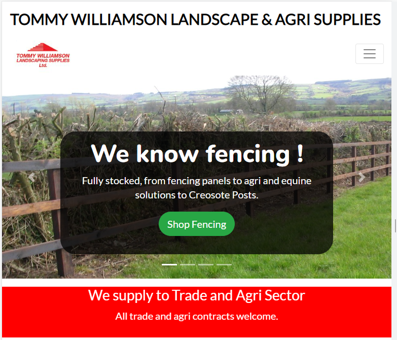
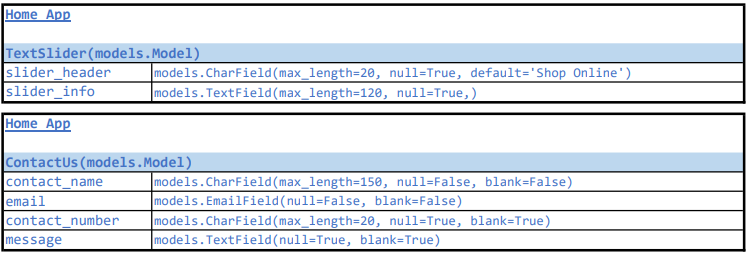

# E-commerce Site of Hardware and Landscaping Supplies Business

​
<p align="center" width="100%"> 

</p>

<span style="font-weight:bold; font-size:16px">Project Brief</span>
<p> This project is for the design and deployment of a functional E-commerce website for a business which supplies materials, hardware and tools primarily in the areas of Agriculture, Landscaping and Construction. </p>


[This is an external link to the site](https://tw-shop.herokuapp.com/)


<br>

<span style= "font-weight:bold; font-size:16px">Origins Of The Project</span>
<p> The business has an established traditional bricks and mortar store but is looking to enter the E-commerce space to offset the potential impacts of a slowdown in the construction sector related to a potential recession and new environmental rules relating to certain products that they currently sell. </p>

<span style="font-weight:bold; font-size:16px">A Proposed Solution</span>
<p>The proposed plan is to design an E-commerce solution and marketing strategy to attract and retain new customers with direct to customer sales and marketing in a Business to Customer format. </p>

<br>

<p align="center" width="100%"> 

</p>


## Contents
​
- [Tommy Williamson Landscape & Agri Supplies](#contents)
  - [Contents](#contents)
  - [UX](#ux)
    - [Project Goals](#project-goals)
    - [User Stories](#user-stories)
    - [User Requirements and Expectations](#user-requirements-and-expectations)
      - [Requirements](#requirements)
      - [Expectations](#expectations)
    - [Design Choices](#design-choices)
      - [Fonts](#fonts)
      - [Colours](#colours)
      - [Images](#images)
      - [Agile Methodology](#agile-methodology)
  - [Marketing Strategy](#marketing-strategy)
    - [SEO](#seo---search-engine-optimization)
  - [Wireframes](#wireframes)
    - [Site Layout](#site-layout)
  - [Information Architecture](#information-architecture)
  - [Technologies](#technologies)
    - [Languages](#languages)
    - [Libraries & Frameworks](#libraries--frameworks)
    - [Tools](#tools)
  - [Features](#features)
    - [Implemented Features](#implemented-features)
    - [Future Features](#future-features)
  - [Development](#development)
    - [bUg5 & (F)ixe5](#bugs--fixes)
  - [Testing](#testing)
    - [User Test Information](#user-test-information)
  - [Deployment](#deployment)
    - [Final Deployment](#final-deployment)
    - [Cloning](#cloning)
  - [Credits](#credits)
    - [Image editing](#image-editing)
    - [Code ideas](#code-ideas)
  
​
---
​
## UX
​
### **Project Goals**
​
<p>Development of a fully functional E-commerce platform taking into some basic User Stories originating from the Agile design process and build on to further features. </p>

​
### **User Stories**
<p>The project was designed using the concepts of the Agile approach. A project was opened on Github and linked to the repository. </p>

USER STORIES:​
<p>I have attached a link to the User Stories and their status. </p>

[Link to Kanban Board](https://github.com/users/TNolan01/projects/5)

|GitHub Link |	Issue Type |	Description |	Tested |	Completed |
|------------|-------------|--------------|--------|------------|    
|https://github.com/TNolan01/tommy1/issues/1| 	USER STORY |	As a shopper I can register and new account with login features.| Test# 10 | Passed 30-Sept-22 |
|https://github.com/TNolan01/tommy1/issues/2| USER STORY	| As a shopper I can view a list of products for sale.	|	Test# 12 | Passed 30-Sept-22 |
|https://github.com/TNolan01/tommy1/issues/3|	USER STORY |	As a shopper I can sort and view products via categories to easily find what I am looking for.| Test# 12 | Passed 30-Sept-22 |	
|https://github.com/TNolan01/tommy1/issues/4|	USER STORY	| As a shopper I can add and remove items from my basket.	| Test# 13 | Passed 30-Sept-22 |
|https://github.com/TNolan01/tommy1/issues/5|	USER STORY	| As a shopper I can purchase items I have put in my basket.|	Test# 11 | Passed 30-Sept-22 |	
|https://github.com/TNolan01/tommy1/issues/6|	USER STORY	 | As a shopper I can review my order before completing my purchase.| Test# 7 | Passed 03-Sept-22 |		
|https://github.com/TNolan01/tommy1/issues/7|	USER STORY	| As a shopper I will receive an email to confirm my purchase. | Test# 11 | Passed 30-Sept-22 |		
|https://github.com/TNolan01/tommy1/issues/8|	USER STORY | As a shopper I can sign up to receive details of special offers.| Test# 8 | Passed 30-Sept-22 |		
|https://github.com/TNolan01/tommy1/issues/9|	USER STORY | As a shopper I can browse the site of phone, tablet, and desktop screens.| General | Passed |		
|https://github.com/TNolan01/tommy1/issues/10| USER STORY |	As a visitor I can view and navigate the site with ease.| General | Passed |			
|https://github.com/TNolan01/tommy1/issues/11|	USER STORY |	As a site user I can see notification messages so I know the site is aware of the actions I have taken and these actions are confirmed.| General | Passed |		
|https://github.com/TNolan01/tommy1/issues/12|	USER STORY |	As a returning user the site will remember my address for fast checkout. | Test# 11 | Passed 30-Sept-22 |
|https://github.com/TNolan01/tommy1/issues/13|	USER STORY | As the site owner I can edit and update the details of products and prices. |	Test# 16 | Passed 01-Octo-22 |	
|https://github.com/TNolan01/tommy1/issues/14|	USER STORY	| As the site owner I can remove a product or products which are no longer available. | Test# 17 | Passed 01-Octo-22 | 		
|https://github.com/TNolan01/tommy1/issues/15|	USER STORY	| As the site owner I can add new product(s) to the site. | Test# 4 | Passed 03-Sept-22 |
|https://github.com/TNolan01/tommy1/issues/16| USER STORY | As a shopper I can review my order before completing my purchase. | Test# 13 | Passed 30-Sept-22 |	


​<br>

[Back to content](#contents)

---
​
### **User Requirements and Expectations**
​
#### **Requirements**
​
- Visually pleasant site design and layout.
- Easy site navigation.
- Content laid out in a simple and clear way on both mobile and larger screens.
- Self-explanatory icons where text is absent.
- Ability to purchase products.
​
#### **Expectations**
​
- Easy to use interface.
- Clear and easy to read data.
- E-commerce functionality.
- Build and contact/marketing database of customers.

​<br>
[Back to content](#contents)

---
​
### **Design Choices**

<p> In this section I set out some of the design choices I made for the front end of the project </p>
​

#### **Fonts**
I used three different fonts from the Google Fonts library.


​```font-family: Lato font - from Google Fonts``` <br>
```font-family: Nunito font - from Google Fonts``` <br>
```font-family: Gloria Halleujah font - from Google Fonts``` <br>

<br>
<p align="center" width="100%"> 

</p>
<br>
<p>Lato was used as the primary font with Nunito used on Carousel items and areas where intention was to break text statements or questions where the site users attention was required to confirm an action, such as the All_Auth templates.</p> 


<br>

#### **Images**
<p>The business has an existing logo image. I have incorporated this into the site header but ideally I would like to design a new logo. </p> 
<br>

<p align="center" width="100%"> 

</p>

<br>
<p>A Favicon icon package was created using my drawing of the one of the company's delivery trucks as inspiration. The business has always used the same color scheme on its vehicles and as such they are an identifiable symbol of the business. </p> 

<br>

<p align="center" width="100%"> 

</p>

<br>

#### **Color Scheme**
<p>The front-end is styled in line with an existing color scheme which they employ across company uniforms and the vehicles. My initial design process was leaning towards a palette of greens and whites to create a light, bright and natural color scheme, following a meeting with the business owner it was preferable to them that their existing color scheme was carried into the site. </p>
<p>I worked with principal color scheme for the site of red, black and white. Having researched E-commerce platforms operating in a similar market I found that this scheme was popular and contrasted well with the products. </p>

**White #FFFFFF**
<p>White is the primary background color. I have used a collage of garden plans and garden layout sketches with a low opacity as background on some pages which helps create depth to the pages. The collage consists of images from Pinterest that I edited and altered with an image editing application. </p>
<p>

**Black #000000**
<p>I have used black and white on the styling of the buttons and as strong bold on text elements. </p>

**Red #CF0808 and #FF0000**
<p>I have used two reds, I have a standard bright red, #FF0000, and flatter and darker red, #CF0808. The latter is the red which best matches the color that the business had been using in its branding and is a more toned down red and does not invoke the as much 'danger' as the #FF0000. </p>
<p>The brighter red, #FF0000, is only used a background color on a text carousel feature on the home page. Its primary function here to attract attention. </p>
<p>While the color red has plenty of energy and is an extremely successful color for many brands such as Coca Cola, McDonalds and Ferrari there are some psychological issues with it as color. Red is often the color of warnings and danger and so I have limited its use as hover activation color on the nav-bar and as a thin border around the product category tiles which activates on a hover function as visual indication. </p>
<br>

<p align="center" width="100%"> 

</p>
​
<br>

#### **Agile Methodology**

<p>The design, development and testing of this application were tracked through a Kanban board in a created GitHub project. Details of the User Stories can be found in the UX section and the link to the Kanban board below. </p>


[User Stories](#user-stories) - see details of each User Story.
[Link to Kanban Board](https://github.com/users/TNolan01/projects/5)
<br>

<p align="center" width="100%"> 

</p>

<br>


[Back to content](#contents)


---
​

## Marketing Strategy

### SEO - Search Engine Optimization

<p>As part of the SEO for this site I have compiled a list of keywords. These keywords have been included in the site header under the meta tag 'keywords'. A '<title>' has also been included on the base.html with the text <strong>Tommy Williamson Landscape & Agri Supplies</strong>. </p>
<p>To further help search function I am using descriptive text on the product images, in addition where possible I have descriptive text on anchor tag elements.</p>
<p>The products and items on all have alt tags created from the product name. I will use Brand names in the name of certain products. </p>

#### Keyword Research:
<p>List of keywords was compiled and included in the site header. In addition, a simple title element was add to the base.html</p> 
<ul>
<li>Tommy Williamson Landscaping and Gardening Supplies</li>
<li>Arches</li>
<li>Pergolas</li> 
<li>Bark Mulch</li> 
<li>Composted Topsoil</li> 
<li>Farm Fencing Stakes</li> 
<li>Garden Sprays</li> 
<li>Gates</li> 
<li>Farm Gates</li> 
<li>Timber Wooden Gates</li> 
<li>Ground Cover</li> 
<li>Lawn Seed</li> 
<li>Light Hardware</li> 
<li>Manure</li> 
<li>Play Equipment</li> 
<li>Post & Rail Fencing</li> 
<li>Railway Sleepers</li> 
<li>Stone Cobble</li>
<li>Brick</li> 
<li>Stone</li> 
<li>Decorative Stone</li> 
<li>Stone Natural Paving</li> 
<li>Timber</li> 
<li>Decking Timber</li> 
<li>Kiln Dried</li> 
<li>Treated Timber Stakes</li> 
<li>Timber Panels</li> 
<li>Fencing Boards</li> 
<li>Wire</li>

#### Proposed Strategy

<p>This market place is quite crowded, and having done some market research it is clear there are many competitors in this E-commerce space. I would propose that the business looks toward creating original content for release on social channels.</p>
<p>A search of Youtube brought up a number of Irish channels in the Agricultrual space which have been releasing content on YouTube. The content is organic and primarily catalogues the goings on and happenings in their business. As you skip through some of this content you can see the rapid development of connections between the content creators and their suppliers with benefit for both parties. </p>
<p>This type of content creation could work very well for this business.</p>


<strong>Strategy</strong>:
<ul>
<li>Create short videos demonstrating products. </li>
<li>Create videos of 'DIY' projects using products sold by the business.</li>
<li>Develop a partnership with suppliers and trade customers to add value for all parties. A partnership with a landscaping business detailing before and after garden transformations or demonstrations showing products in use. </li>
<li>Market the business as a source of information, create and develop a Frequently Asked Question section and lean on the approachability and knowledge of the staff. </li>
</ul>


#### Facebook
<p>The business has an active Facebook page. I would look to integrate Facebook posts into the site in some shape. </p>
<br>

<p align="center" width="100%"> 

</p>

<br>
<p align="center" width="100%"> 

</p>

<br>


---


## Wireframes
​
### **Site Layout**

<p>The initial front end layout for the site was created from the wireframes developed in Balsamiq. The wireframes can be viewed via the link below.</p>

<br>

<p> When the wireframes were rendered on screen with Bootstrap, HTML and CSS there were slight changes to the UX design and layout. As the development process continued further style changes were made in the screen layout. The layout was altered in line with some live testing.</p>

​[Link to Wire Frames](readme_docs/wireframes/wireframes.pdf)

<p> I initially layout used logos or icons to represent the different product categories on the index.html, as sampled below. However, after showing the layout to some people I found the 'icon' style images were not popular. The photo images now used are far more aesthetically pleasing and would be more visually appealing to customers. </p> 
<br>
<p align="center" width="100%"> 

</p>

<br>

<p> It was clear from looking at the business that they had an affinity for there delivery trucks. All past and present delivery trucks are red in color. I felt that a truck image could be a digital icon for the business. I found some technical drawings online and sketched over them with a pen and carbon paper to create a profile. I scanned this profile image in 3D Paint. I used this image for the Favicon pack. I would like to have used it as the business logo as I think it is very identifiable with the business. Based on time constraints I decided to stick with the existing business logo. The re-design of the logo would be a Future Feature. </p>
<br>
<p align="center" width="100%"> 

</p>

<br>


[Back to content](#contents)
​

---
​
## Information Architecture
​
### **PostgreSQL Database**

<p>The backend database is a PostgreSQL Database hosted via Heroku. The database is built around several separate apps which have models as listed below.</p>
<br>

#### **Apps and associated models:**

<p align="center" width="100%"> 

</p>

<br>

<p align="center" width="100%"> 

</p>

<br>

<p align="center" width="100%"> 

</p>

<br>

<p align="center" width="100%"> 

</p>

<br>

<p align="center" width="100%"> 

</p>

<br>

​
[Back to content](#contents)
​

---
​
## Technologies
​
### Languages
​
- [HTML](https://developer.mozilla.org/en-US/docs/Web/HTML)
- [CSS](https://developer.mozilla.org/en-US/docs/Web/CSS)
- [JavaScript](https://developer.mozilla.org/en-US/docs/Web/JavaScript)
- [Python](https://www.python.org/)
​
### Libraries & Frameworks
​
- [Django](https://www.djangoproject.com/)
- [Google Fonts](https://fonts.google.com/)
- [Font Awesome](https://fontawesome.com/)
- [Favicon](https://favicon.io/)
- [jQuery](https://jquery.com/)
- [Bootstrap](https://getbootstrap.com/)
- [Crispy Forms](https://django-crispy-forms.readthedocs.io/en/latest/)
- [Pillow](https://pypi.org/project/Pillow/)
- [Stripe](https://stripe.com/ie)
- [Crispy Forms](https://django-crispy-forms.readthedocs.io/en/latest/#)
- [baguetteBox](https://feimosi.github.io/baguetteBox.js/)
​
### Tools
​
- [Git](https://git-scm.com/)
- [GitHub](https://github.com/)
- [Balsamiq](https://balsamiq.com/) - Wireframe tool
- [3D Paint](https://apps.microsoft.com/store/detail/paint-3d/9NBLGGH5FV99)
- [Affinity](https://affinity.serif.com/en-us/)
- [PolicyMaker.io](https://policymaker.io/)
- [WebP Image Converter](https://www.online-convert.com/)

### Deployment

- [Heroku](https://www.heroku.com/)
- [AWS, Amazon Web Services](https://aws.amazon.com)

[Back to content](#contents)

---
​
## Features
​
<p>The application uses a PostgreSQL database which contains the purpose designed models with back-end being built on the Django Framework. The site is designed with the following base features. </p>
<br> 

​- The site has **responsive design** when viewed on a mobile, tablet, and desktop.

- **Easy navigation** to external sites, such as social media accounts.

- **Visually appealing** images and content.

### Implemented Features

**Nav Bar**

<p>The Nav Bar is standard across all pages. It contains a link to <strong>Home</strong>, <strong>Contact Us</strong>, and an <strong>Inspiration Page</strong> which is a picture gallery. </p>
<p>There is a drop-down menu for navigation to the different product categories and an Account link to allow new users register or login if already registered. Beside this there is a basket icon which will show current total of items in the basket if there are any. </p>
<p>Positioned on the right of the nav-bar is the search function to search through products for key words. </p>
<p>I have also incorporated the company logo into the nav bar as part of the branding. </p>
<p>Nav bar link text will turn red on hover to further highlight the options and introduce some red into the color scheme. </p>
<br>

<p align="center" width="100%"> 

</p>

<strong>Administrator Function:</strong>
<p>If the user is logged in as the site administrator the 'My Account' drop will include four additional links. </p>
<ul>
<li>Product Management</li>
<li>Update Site Banner</li>
<li>Newsletter</li>
<li>Email List</li>
</ul>
<br>

<p align="center" width="100%"> 

</p>
<br>

<strong>Product Management</strong>
<p>This option allows the administrator to add and new product to the site. </p>
<br>

<strong>Update Site Banner</strong>
<p>Update Site Banner option allows the administrator to quickly change the text content and the header of one of the text-carousels which auto slide under the image carousel on the home page. This allows the administrator access to put a quick message directly on the home page. </p>
<br>

<strong>Newsletter</strong>
<p>The administrator can see all products currently available as 'special offers' which would form part of the newsletter sent to subscribers. </p>
<br>

<strong>Email List</strong>
<p>This link will show a list of all emails currently subscribed to the newsletter. From here the admin can also delete an email address from that list. </p>
<br>

<p align="center" width="100%"> 

</p>
<br>

**Footer**
<p>Like the nav bar the footer is standard across all pages. The footer contains links to company social media channels.</p>
<p>The footer also contains a link to the company's privacy policy. This opens in seperate window.</p>

<br>

**Home Page**
<p>The home page contains a large picture carousel which auto scrolls. This is positioned just below the nav bar. The carousel contains four separate images. Each image is overlayed with a text box and each text box contains a button. The text relates to the image and the destination for the associated button will bring to a relevant point on the site inline with image and text. The purpose of the carousel is to act as four advertisements. </p>
<p>The central content of the homepage are the product cards. These cards contain text and an image. Each card will bring you to a separate product category page. The borders on the cards will turn red when hovered over. The images are to be visually appealing and need to represent the relevant product category. </p>
<p>Below the product cards and over the footer there a 'supplier slider', this is another carousel which contains logo's for the companies whom supply products to the business. This is auto scrolling. At present if a user clicks on a supplier logo they are taken to that suppliers website, which opens in a new page. As a future feature I would look at returning a template of all products available relating to the particular supplier for purchase on this site. </p>
<br>

<p align="center" width="100%"> 

</p>
<br>

**Contact Us**

<p>Self-explanatory, this page contains all the relevant contact details for the business. There is also a contact us form to allow the site user quickly send their queries and contact details to the business. This information is stored in a model, with a copy of the query and contact details to be emailed to a company sales email address for follow up by sales staff. </p>
<p>I have included social media links here also. I have also included an opening hours feature which shows the current day highlighted in red. </p>
<p>Below the contact details and contact us form there is link to subscribe to the newsletter. There is animated border around this button to attract the site users attention. </p>
<p>This page also contains an embedded Google Map with the location of the business central on the rendered map. Just below the map there is link to allow any user subscribed to newsletter to unsubscribe, naturally if the user tries to unsubscribe from the newsletter mailing list with an email address that is not on the list they will receive a validation error message.</p>
<br>

<p align="center" width="100%"> 

</p>
<br>

**Inspiration** 

<p>This page would form part of the larger marketing strategy, the page is essentially and image gallery which is built using BaguetteBox which is a JavaScript library, this generates a lightbox with animated and responsive images. There are currently nine images in the gallery but this would be expanded. </p>
<p>The images 'zoom on hover', as part of that function description text for each image is also displayed. If a user clicks on any image the image will occupy full screen and an exit control and left and right directional arrows will be shown. The user can now scroll through all the images in the gallery or exit back to grid display mode. </p>

**Products Page** 

<p>The product page will display a card for each product item matching the user selected category, the name of the category will be displayed at the top of the page. Below this to the left the number of products in this category will be displayed and, on the right will be the 'Sort By' dropdown options box. </p>
<p>The users can sort the displayed products in the following ways:</p>
<ul>
<li>Price - low to high</li>
<li>Price - high to low</li>
<li>Rating - low to high</li>
<li>Rating - high to low</li>
<li>Name - A to Z</li>
<li>Name - Z to A</li>
<li>Category - A to Z</li>
<li>Category - Z to A</li>
</ul>
<br>

<p>The border around the product card will also turn red on hovering over the card. Once a particular product card is selected a products detail page is displayed for that particular product. The image will be on the left of the screen and the details and price will be displayed on the right. Just below the details will be the quantity box which the user can use to alter the quantity of the product required. Clicking the 'ADD TO BASKET' button will deposit the quantity selected into the basket.</p>
<p>The 'KEEP SHOPPING' button will return the user back to the products section.</p>
<p>Clicking the product image will that image in a new window in a full screen size.</p>
<p>I a particular product is marked as being on special offer the works "This item is on special offer" will appear in <strong>flashing red text</strong> below the description. Items not marked for special offer will not have this feature.</p>
<br>

<p align="center" width="100%"> 

</p>
<br>

**Shopping Basket**

<p>When an item is added to the basket a success toast will display a summary. This toast is built on structure of the Boutique Ado toasts and will display the product summary and an indication of any delivery charge or how far the customer is away from getting free delivery.</p>
<br>

<p align="center" width="100%"> 

</p>
<br>

<p>The shopping basket has all expected functionality, update quantity of product(s) in the shopping basket or removing and item completely. Delivery charges are calculated based a percentage as set in the settings.py file. </p>

```
{
#variables for delivery charges
FREE_DELIVERY_THRESHOLD = 75
STANDARD_DELIVERY_PERCENTAGE = 10
}
```

<p>I adapted some code from https://css-tricks.com/responsive-data-tables/ to adjust the table in the shopping basket template to vertical scroll on mobile devices.</p>

<br>

<p align="center" width="100%"> 

</p>
<br>

<p>Payment processing is powered by Stripe with a webhook handler to process webhook requests. This process is largely in line with Boutique Ado.</p>
<br>

**Order Number**

<p>I have created a Python method to generate an unique order number.</p>

```
  # private method - order number generator
    def _generate_order_number(self):
        now = datetime.now()
        d = now.strftime("%m/%d/%Y")
        h = date_time = now.strftime("%H")
        random_number = str(random.randint(1000, 9999 - 1))
        order_number =(f'{d}{h}-{random_number}')
        order_num = order_number.translate({ord('/'): None})
        return order_num
```

<p>Order numbers are made up of the numerical value for the MONTH, DAY, YEAR, the current hour, a hyphen and then a randomly generated four-digit number. In this format it would allow the business owner to tell the date and hour that the order was created with just the order number and hence help track any issues with a customer's order easier than just using a completely random order number. </p>
<br>

<p align="center" width="100%"> 

</p>
<br>

<p>I the above example we can see that the order number is <strong>0926202219-2775</strong>. This breaks down as follows....</p>
<ol>
<li>09 is for the month, here is the Month, September.</li>
<li>26 is the day in the month, in this case the 26th day of the month.</li>
<li>2022 is the four digit indicator for the year, in this case that is 2022.</li>
<li>The four digit code that precedes the hyphen is randomly created by the Python method.</li>
</ol>
<br>

**Newsletter**

<p>There is link on the Contact Us page to allow a site visitor to register for the company newsletter, there is also an unsubscribe link at the bottom of this page. On of the picture carousels on the Home page also has a link to allow visitors subscribe. I feel it is a better marketing strategy to allow all visitors, regardless of the fact they may already have an account or if they do or dont make a purchase, to sign up with an email address. </p>
<p>The newsletter is generated from all products that have been marked as on <strong>special offer</strong>. Any product marked in such a way is included on the newsletter automatically. The site administrator can see these items from their dropdown menu on the nav bar (when logged in as administrator!) </p> 
<p>By selecting any product on this list the admin can choose the edit option and 'untick' the special offer box to remove that product from the newsletter. </p> 
<p>The <strong>Email List</strong> option the drop 'My Account' dropdown menu will show all the newsletter subscribers and by clicking the <strong>Send Newsletter</strong> button the admin will send the newsletter to all subscribers. From here the admin can also delete subscribers from the list. </p>
<br>

<p align="center" width="100%"> 

</p>
<br>

**Profile** 

<p>The user profile section is split into left and right side. The users contact details and address are on the left side of the screen. The right side of the screen has a list of all that customers orders, order history. When logged in the user can edit their contact details and select a previous order to see its details.</p>
<br>

<p align="center" width="100%"> 

</p>
<br>


### Future Features

- Removal of the admin features from the nav bar dropdown menu and the creation of a separate dashboard menu for the administrator.
- The user profile has an option to allow the user state if are a domestic of business customer. I would use this to target the different groups with different types of offers. Showing the pricing for Business customers excluding VAT.
- Creation of section with 'how to' or 'DIY' style videos to further market the products. There would be some form of integration with this content and the companies social media channels.
- Look into the styling and format of the Newsletter. 
- Collate emails of registered user to the site for the creation of a marketing email list targeted towards their previous purchases.
- Create a new business logo in SVG format that can better promote the brand.
- Change supplier carousel logos to display all products availible on the site for that particular supplier.
- Standardize the pictures sizes used on the site and the convert to WebP format. 


[Back to content](#contents)
​

---
​
## Development

<p>In this section I deal with some of the bugs and errors encountered during the development process. If the issue was successfully fixed I have included details of that fix. </p>

## Bugs & Fixes
<p>This section consists of issues I had during development which took me 60 minutes plus approximately to identify and sort. </p>

### Issue No.1
<h4>Webhooks and Stripe:</h4>
<p>During the setup of the Stripe webhooks I was initially not able to get 'intent' details back and printed to the terminal. After some investigation I discovered that this was because Port 8000 was set to Private and not Public as was required. Once this was created the transaction information was printed to the terminal. </p>

### Issue No.2 
<h4>Webhooks the return!:</h4>
<p>Having successfully tested the webhooks in the development environment I moved on to other aspects of the project. I approached a point where I needed to test User Stories and so setup an email address and setup webhooks in Stripe with a new endpoint URL for the deployed site and tested. </p>
<p>While test payments were being successfully received and processed in Stripe none of the webhooks were functioning and emails were not being sent. The Stripe dashboard returning a 500 Error. </p>
<p>After a period of unsuccessful testing I had to create a new endpoint in Stripe with an URL of my development environment. I edited the webhook secret to matched and tested the functions in the development site with feedback in the terminal. The Error 500 was traced back to typo in the webhook_handler.py. Once the error was corrected I changed the webhook secret back to deployed site value and retested. </p>
<p>Testing was now showing that webhooks were functioning correctly and emails were sent successfully. </p>

### Issue No.3
<h4>AWS, S3 Bucket and 'SignatureDoesNotMatch'</h4>
<p>I was going to upload some stock/product to the site late on 4th of October, as a test I decided to carry out this process on the deployed site to test the process as it would be for the site owner. After logging in with admin creds and completing the 'New Product' form I attached an image and clicked 'Submit'. </p>
<p>I was met with my first error message, <strong>Ibotocore.exceptions.HTTPClientError: An HTTP Client raised and unhandled exception: Invalid header value b'AWS4-HMAC-SHA256 Credential=-n ACCESS_KEY\n/00000000/eu-west-1/xxx/aws4_request, SignedHeaders=content-type;host;x-amz-date;x-amz-target, Signature=XXXXXXXXXX'. </strong> With searching I discovered the problem may have been caused by white space or new line being generated around the AWS ACCESS_KEY and AWS Secret_KEY values. The suggested fix was to use .strip command to remove the white space around the KEY values. </p>

```
AWS_ACCESS_KEY_ID = os.environ.get("AWS_ACCESS_KEY_ID").strip("\n")
AWS_SECRET_ACCESS_KEY = os.environ.get("AWS_SECRET_ACCESS_KEY").strip("\n")

```
<br>
<p>Once I had altered the settings.py and pushed the changes I tried to add a new product. This time the error changed to 'SignatureDoesNotMatch'. I tried to add a product from the Django Admin Interface but the fault was still the same. With testin I found I could upload all details of new product *except* an image and so the fault appeared to be the upload process of an image to the S3 storage on AWS.</p> 

<p>Another search suggested the issue could be the result of several problems but the most common suggestion was that there was an issue with the AWS key values. The values were either completely wrong or prehaps entered incorrectly. A further potential fix suggested that the error could be to do with the possible presence of a special character, such as a / or a +, forming part of the AWS_SECRET_ACCESS_KEY.  </p>
<p>There were reports that Heroku did not like the special characters in the Access Key. The fix was simple, login to AWS Dashboard and request a new Access Key from the Security Credentials option. The best option was to keep requesting new Access Keys until I receive a key which contained no special characters. With suitable access keys created I downloaded the CSV file and copied the Access Keys in Config Vars in the Heroku dash. </p>
<p>With new security keys I again tried to add a product - the fault was still present. I checked through the error report, looked and potental issues with the content-type and header information. I checked what information I was sending to AWS and checked the Bucket Policy, IAM and S3 settings in AWS Dashboard. I deleted the old inactive AWS access keys from IAM dashboard and ensured that the ACCESS KEY I was using the active and correct. </p>
<p>I was very confident that the issue was the AWS access keys, I checked them again in the Heroku dashboard, both matched. I double checked against the downloaded CSV, match. I decided to delete both key values and enter them manually as oppose to copying and pasting them from the CSV file. With both values entered and Heroku build updated I re-tried the 'Add Product' process. The result was successful with the new product and image uploaded to the site straight away.</p>
<p>I tested the 'Add Product' process on a mobile device and found in worked correctly also.</p>
<p>It might have been that white spaces were added add as part of the copy and paste process (?)</p>

---

## Testing
​
## Functional Testing

<p>Manually testing was carried out throughout the development process. Details of specific manual are located in a separate test document.</p>

<strong>Testing Results:</strong> 

[Link to manual testing](readme_docs/Testing_Doc.md)

<strong>Test of Purchase and Payment</strong>

[Link to manual testing](readme_docs/Testing_Doc2.md)


<br>​
​

## Validator Testing

​
### <span style="font-weight:bold; font-size:20px">CSS</span>
​
<p>The CSS file was directly input into https://jigsaw.w3.org/css-validator/#validate_by_input. The validation returned one error for a transform property, this is part of an animation feature on the 'Subscribe' button and has been left in place to allow that function.  </p>
<br>

<p align="center" width="100%"> 

</p>
<br>


​​<br>


​
### <span style="font-weight:bold; font-size:16px">JavaScript</span>

<p>The script.js file was tested with [JSHint](https://jshint.com/), any errors found were corrected. A link to a PDF of the JSHINT screen shoots can be found below.</p>
​<br>

[Link to JSHint Report](readme_docs/testing_images/jshint_validation.pdf)
<br>

### <span style="font-weight:bold; font-size:20px">HTML</span>
​
HTML files associated with this project were tested individually with [W3C Validator](https://validator.w3.org/) and showed no errors or warnings. 
<br>


### <span style="font-weight:bold; font-size:20px">Python</span>
​
<p>Python code was validated by running the following command:<strong>python3 -m flake8</strong>. This produces a list of errors and warnings. I then ran 
<strong>autopep8 --in-place --aggressive --aggressive <file name></strong> on each .py file to format the code to the correct syntax automatically. </p>

<p>It was also necessary to manually correct some errors which involved split long lines.</p>

​<br>

### Flake8 Report ###

<p> I have attached a link of the results from intitial run of flake8</p>

[Link to Flake8 Report](readme_docs/testing_images/python_validation.pdf)

<p>After refactoring of the Python code I created, I was left with the following list. </p>

<p align="center" width="100%"> 

</p>
<br>

<p>I have not alter the E501 errors in the env.py as these lines are Access Keys and I dont want to split them and introduce an error.</p>
<p>The <strong>checkout app</strong> errors are left as they are part of a functioning webhook process.</p>


---

### <span style="color:#ebd80c; font-weight:bold; font-size:16px">Light House Performance Testing</span>

### Desktop Performance :
<br>
<p align="center" width="100%"> 

</p>
<br>


### Mobile Performance :
<br>
<p align="center" width="100%"> 

</p>
<br>

<br>
<p align="center" width="100%"> 

</p>
<br>

<br>
<p align="center" width="100%"> 

</p>
<br>

[Back to content](#contents)

​
---
​
## Deployments
​
### Deployment:

<br>

Deployment of this project was carried out with Heroku, https://www.heroku.com. The deployment procedure is a follows.  
<ol>
<li>Log in to Heroku, creating a new account if you are not a current user.</li>
<li>Click on the 'New' button in the top right corner and from the drop-down menu select 'Create new app'.</li>
<li>Create an App name and select your Region from menu.</li>
<li>Click the 'Create App' button.</li>
<li>Click in resources and select Heroku Postgres as the project database.
<li>You will now have a menu for your new app. From here click on the Settings Tab and in the Config Vars. Click Reveal Config Vars. <br>
<ul>
<li>add your Secret Key</li>
<li>add PostgreSQL URL</li>
<li>add PORT with value '8000'</li>
<li>add a record - 'DISABLE_COLLECTSTATIC = 1'</li> 
</ul>
</li>

<br>
<p align ="center">
</p>
<br>

<li>Scroll down to the Buildpacks section. Click Add buildpack. From the menu select heroku/python and click Save Changes. </li>

<br>
<p align ="center">
</p>
<br>

<li>Return to menu at the top of the page and click on Deploy. Select Github as the deployment method.</li>
<li>Confirm you want to connect to GitHub using your account credentials for Git. Once Heroku has access search for the relevant repository name and click the connect button.</li>
<li>At the bottom of the deploy page select the preferred deployment type. You can use Manual Deploy which will deploy based on the current state of the selected Git branch. You can also Enable Automatic Deploys for automatic deployment when you push updates to Github selected branch.</li>
</ol>
<br>

## Amazon AWS 
### Setting AWS bucket


1. Create an account AWS [Amazon Web Services](https://aws.amazon.com/) or login to an existing account (Credit Card required to register an account.)

2. Navigate to the AWS Management Console and search for S3 Service.

3. Create a S3 Bucket using **Create Bucket** button in top right-hand corner

4. Name the Bucket, in this instance we match the Heroku App name for simplicity.

5. Choose the AWS Region closest to you. 

6. Setup the **Object Ownership**.
- Select - **ACLs Enabled** 
- Select - **Bucket Owner Prefered**

7. Select **Allow Public Access**. Confirm that this setup will make the objects within the bucket viewable by the public.

8. Select **Create Bucket**

9. From your AWS dashboard select your Bucket. Select the **Properties** options and scroll down **Static Website Hosting**. Select Edit, click enable, fill in index doc as index.html and error.html for error option.

10. Within the **Permissions** section find Cross-Origin Resource Sharing, known as **CORS**. Copy code below paste into this in as the new configuration and confirm with 'save'. 

```
[
  {
      "AllowedHeaders": [
          "Authorization"
      ],
      "AllowedMethods": [
          "GET"
      ],
      "AllowedOrigins": [
          "*"
      ],
      "ExposeHeaders": []
  }
]
```
11. Edit the **Bucket Policy** by going to the permissions tab. Select the AWS Policy Generator.

Fill out this page as follows:
**Select Type of Policy** : S3 Bucket policy
**Principal** : * (this allows all)
**Actions**: Get object
**Amazon Resource Name (ARN)** : Copy ARN from the Edit Bucket Policy page in the permissions section and paste it in here

Select **Add Statement** button. 
<br>
<p align ="center">
</p>
<br>

12. Under Step 3, click **Generate Policy** button.
Than Click Generate Policy, the policy will appear on the screen in a window. Copy this policy into the **Bucket Policy Editor**. When copied, add <strong>/*</strong> to end of the **Resource** line.
Save the policy.

13. Go to the **Access control list (ACL)**, click Edit and enable **List** for **Everyone** which is **Public Access**.

14. From AWS Services menu locate **Identity and Access Management (IAM)**.
On the side menu find **User Groups** and click **Create Group**. Enter a name relevant to the groups purpose ie, "manage--app-name". Create the group.

15. From side menu select Policies and click **Create Policy**. 
Select the Import Managed Policy. Search for **AmazonS3FullAccess** and import that policy.
<br>
<p align ="center">
</p>
<br>

16. To restrict access to just the new bucket you must retrieve the ARN from the **Bucket Policy Page** in S3.
Copy ARN again and paste into "Resource" section. 
Add the ARN twice with a <strong>/*</strong> on the second ARNist containint The first line is for access to the Bucket and second line is for all files and folders in that Bucket.
<br>
<p align ="center">
</p>
<br>

17. Select **Add Tags** click Next and on to **Review Policy**. Give the policy a name and a description.

18. Click **Create Policy**. Policy is now created.

19. From **Groups** option in side menu locate our group and select **Permissions** tab and the **Attach Policy** option. Search for the newly created policy and select **Attach Policy**.

20. Select **Users** in the side menu and click **Add User**, create a user in the following format <strong>your-app-staticfiles-user</strong>.
Give the new user **Programmatic Access**.
Add new User to new Group.

21. Select **Tags** and the click **Next** to the Review. Click **Create User**.

22. Download the generate file which is in a .CSV format and has your required security keys.
Click Next Tags and Next: review and Create user
- Download .csv file

### Setting AWS bucket

1. To Connect Django to the new AWS S3 Bucket, run the following commands from the terminal.
- Install boto3 'pip3 install boto3'
- Install django-storages 'pip3 install django-storages'
- Update requirements.txt 'pip3 freeze > requirements.txt'

Update settings.py by including **storages** on the list of installed apps.

Add the following settings to settings.py. to link the Bucket. (Keeping AWS Access keys safe.)

```
if 'USE_AWS' in os.environ:
    # Cache control
    AWS_S3_OBJECT_PARAMETERS = {
        'Expires': 'Thu, 31 Dec 2099 20:00:00 GMT',
        'CacheControl': 'max-age=94608000',
    }

    # Bucket Config
    AWS_STORAGE_BUCKET_NAME = tw-shop
    AWS_S3_REGION_NAME = 'eu-west-1'
    AWS_ACCESS_KEY_ID = os.getenv('AWS_ACCESS_KEY_ID')
    AWS_SECRET_ACCESS_KEY = os.getenv('AWS_SECRET_ACCESS_KEY')
    AWS_S3_CUSTOM_DOMAIN = f'{AWS_STORAGE_BUCKET_NAME}.s3.amazonaws.com'
```

2. Go into the Heroku dashboard and select the relevant app to set up our enviromental variables.

Add the following to your Config Vars.
**AWS_ACCESS_KEY_ID** and enter key value from downloaded CSV file.
**AWS_SECRET_ACCESS_KEY** and enter key value from downloaded CSV file.
**USE_AWS** and enter a value of True.
You can now remove **DISABLE_COLLECTSTATIC** from the Config Vars section.

** Note : as per my Bugs & Fixes section it is best to manually enter the AWS Key values into Heroku Config Vars, copy and paste may result in connection errors.**

3. Create a new file in root directory called **custom_storages.py**

```
from django.conf import settings
from storages.backends.s3boto3 import S3Boto3Storage


class StaticStorage(S3Boto3Storage):
    location = settings.STATICFILES_LOCATION


class MediaStorage(S3Boto3Storage):
    location = settings.MEDIAFILES_LOCATION
```

4. Update the settings.py with the following AWS settings

```
    # Static and media files
    STATICFILES_STORAGE = 'custom_storages.StaticStorage'
    STATICFILES_LOCATION = 'static'
    DEFAULT_FILE_STORAGE = 'custom_storages.MediaStorage'
    MEDIAFILES_LOCATION = 'media'

    # Override static and media URLs in production
    STATIC_URL = f'https://{AWS_S3_CUSTOM_DOMAIN}/{STATICFILES_LOCATION}/'
    MEDIA_URL = f'https://{AWS_S3_CUSTOM_DOMAIN}/{MEDIAFILES_LOCATION}/'

```

5. The easiest way to upload the media files to AWS S3 Bucket is to open the Bucket in AWS dashboard, create a new folder called **media**. From here you can select **Upload** and select the file or files you want to upload.


## Final Deployment
<ul> 
<li>Create a runtime.txt file - 'python 3.8.13'</li>
<li>Run the command - 'web: gunicorn "name of project".wsgi'</li>
<li>In 'settings.py' change the DEBUG to 'DEBUG = False'</li>
<li>In the Heroku dashboard for this app, navigate to 'settings' and delete the entry for DISABLE_COLLECTSTATIC</li>
</ul>


[Back to Contents](#contents) 
<br>

## Cloning:

[Click here](https://help.github.com/en/github/creating-cloning-and-archiving-repositories/cloning-a-repository#cloning-a-repository-to-github-desktop) to retrieve pictures for some of the buttons and more detailed explanations of the above process.

1. Log in to GitHub and locate the [GitHub Repository] https://github.com/TNolan01/tommy1
2. Under the repository name, click "Code".
3. To clone the repository using HTTPS. Under "HTTPS" copy the link.
4. Go to your local terminal with git installed
5. Change the current working directory to the location where you want the cloned directory to be created/located.
6. Type `git clone` and then you paste in the URL you copied in Step 3.

  ```
  $ git clone https://github.com/TNolan01/tommy1
  ```

7. Press Enter. Your local clone will be created.

<br>

[Back to Contents](#contents) 
<br>
​

---

​
## Credits
​
### **Images**
<br>
<p>The images used in this project are taken from the websites of suppliers to the business and photos I took myself</p>
<p>I have used some images of Pinterest to create some of the backgrounds.</p>

### **Image editing**
<br>
<p>The images were edited using the following packages.</p>
<ul>
<li>3D Paint Microsoft</li>
<li>Affinity Designer</li>
<li>Favicon - for creation of Icon Pack</li>
</ul>

​
### **Programming resources**
<p>Aside from the Code Institute content for this section I used the following resources.</p>
<p>I have used the Boutique Ado project walkthrough as the basis for the Stripe and Checkout functions in this project.</p>

- [Stack Overflow](https://stackoverflow.com/)
- [CodeMy.Com on YouTube](https://www.youtube.com/watch?v=HHx3tTQWUx0&list=PLCC34OHNcOtqW9BJmgQPPzUpJ8hl49AGy&index=2)
- [Dennis Ivy](https://www.youtube.com/watch?v=tUqUdu0Sjyc&t=1469s)
- [Ben Goddard(Codepen)](https://codepen.io/bengoddard)
- [CSS Tricks](https://css-tricks.com/responsive-data-tables/)

<br>

[Back to content](#contents)
​

---
​
