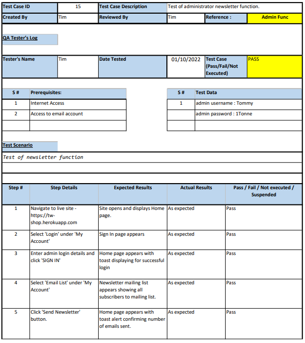

## Manual Testing Documentation

 
<strong>Details of manual testing carried out along with screenshots.</strong>

 

 

 

---

 

 

 

---

 

 

 

---

 

 

 

 

 

---

 

 

 

 

 

---

 

 

 

 

---

 

 

 

---

 

 

 

 

 

---

 

 

 

 

 

 

 

 

---

 

 

 

 

 

 

 

 

 

 

---

 

 

 

---

 

 

 

---

 

 

 

 

 

 

---

 

 

 

 

 

---

 

 

 

 

 

---

 

 

 

 

 

---