## Manual Testing Documentation - Test Of Purchasing

 
<strong>Details of manual testing of purchase, payment system and webhooks.</strong> 

 

 
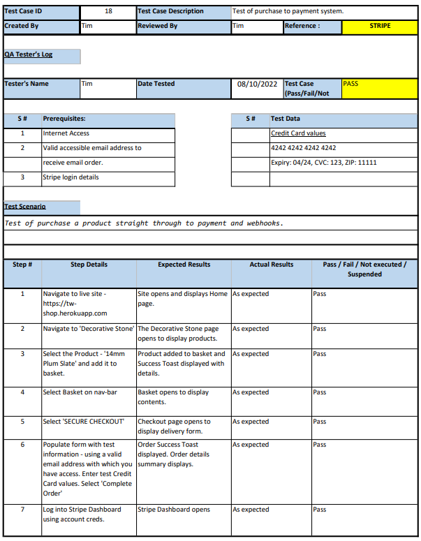

 
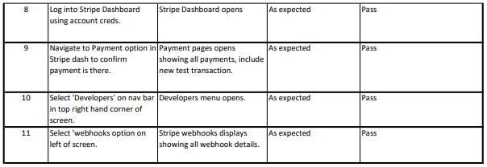

 

 
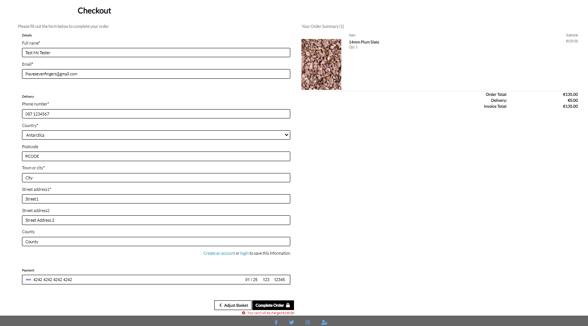

 

 
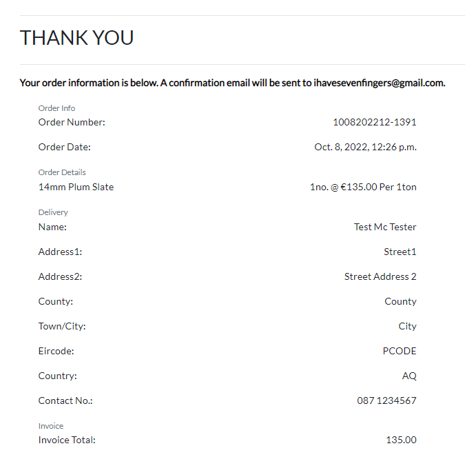

 

 
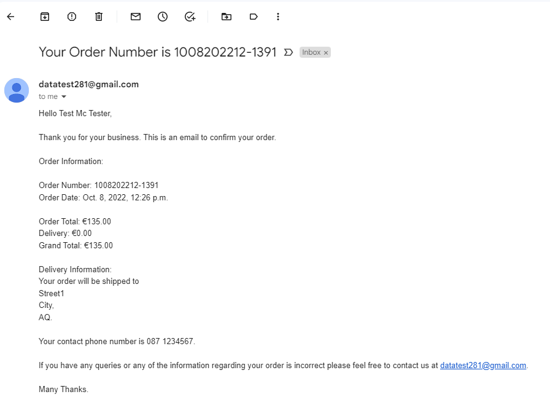

 

 
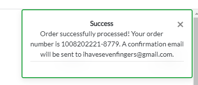

 

 
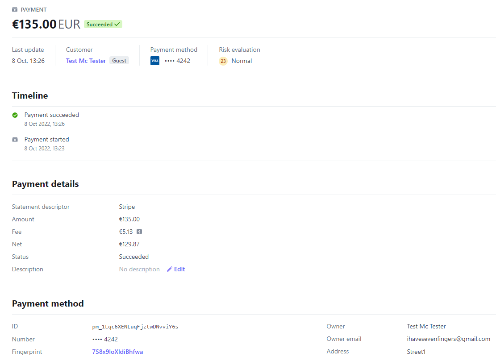

 

 
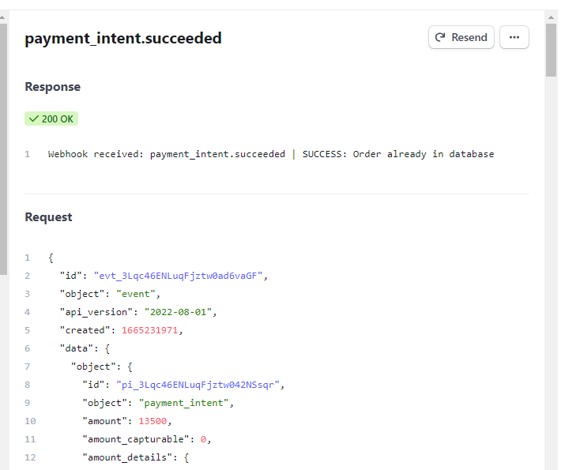

 

 
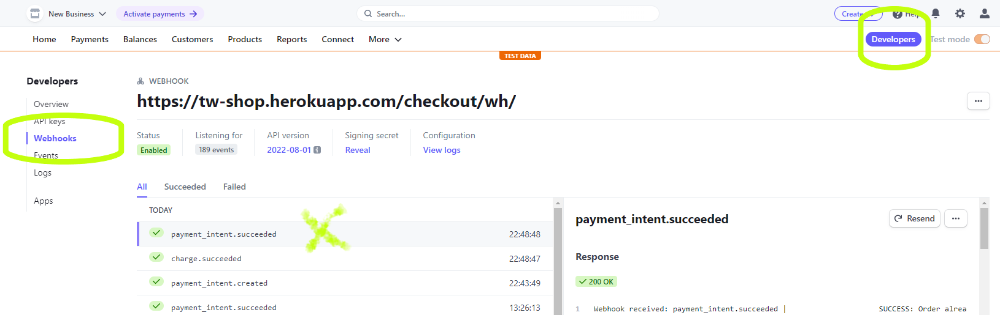

 

 

 

 
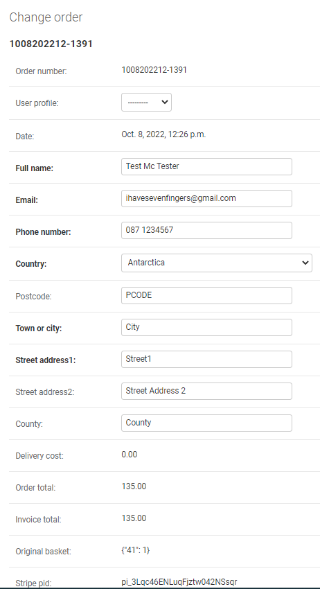

 

 
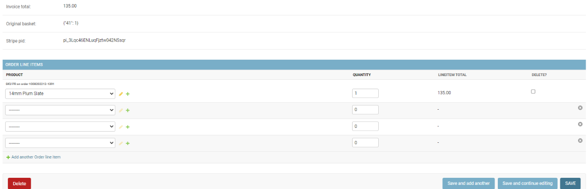

 

---

